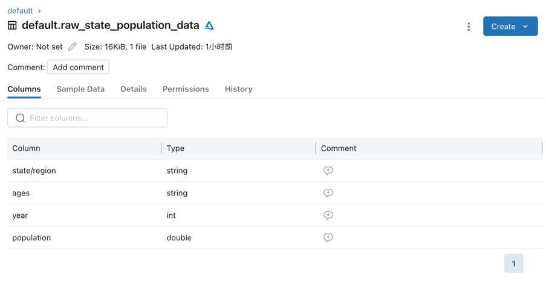
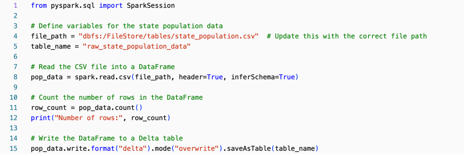
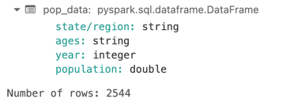
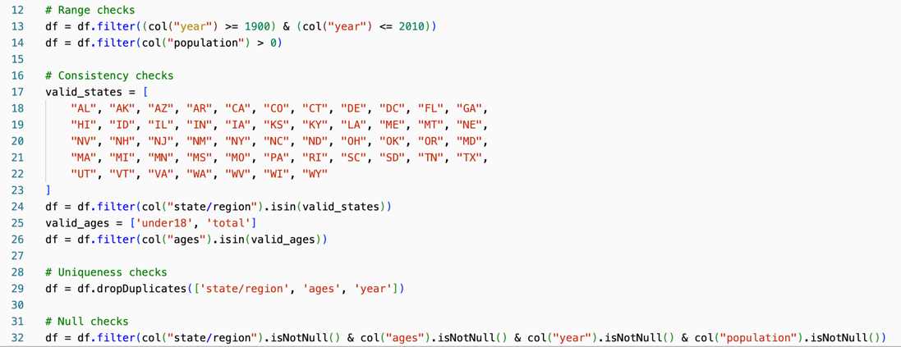
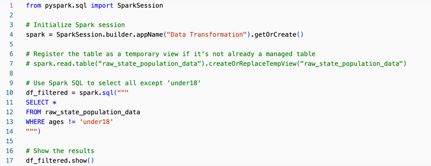
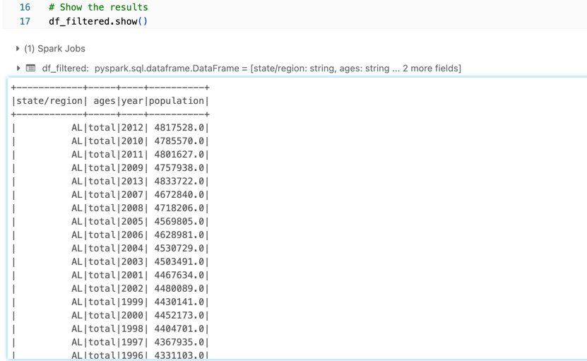
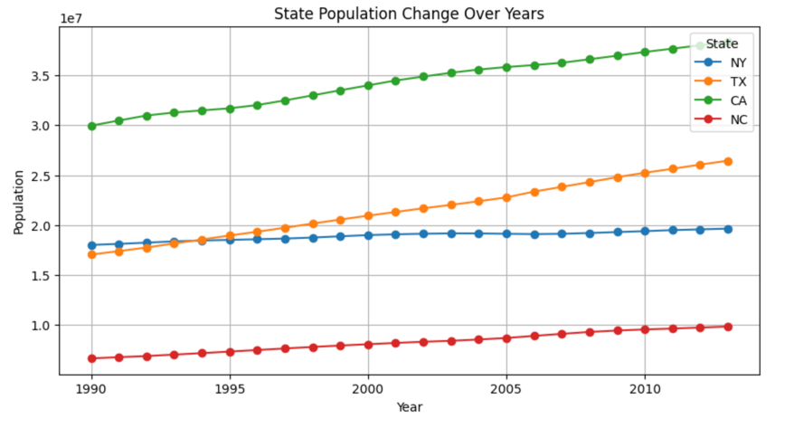
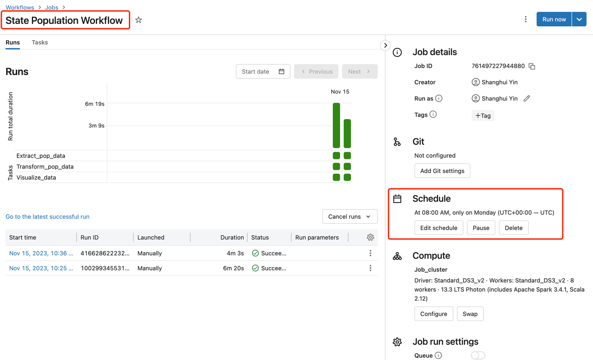

# Databricks ETL Pipeline

> Duke University IDS 706 Individual Project 3

## Youtube Video

[Youtube Video Click Here](https://youtu.be/NhLI6ihzan8)

## Goal

The dataset from [Kaggle](https://www.kaggle.com/datasets/giodev11/usstates-dataset?select=state-population.csv) is a collection of population records for different states within a certain country, presumably the United States given the state abbreviation 'AL' for Alabama. Each record in the dataset contains the following fields:

- state/region: The abbreviation of the state (e.g., 'AL' for Alabama).
- ages: The age group that the population number pertains to. It can have at least two distinct values: 'under18' for the population under 18 years old, and 'total' for the total population of the state.
- year: The year when the population data was recorded.
- population: The number of people in the specified age group for the state in that year.



## Extract Data

Data is extracted from a CSV file. The following code snippet shows how to read a CSV file from `dbfs`.



The following code snippet shows results.




### Data Validation

In addition, following data validation is performed to ensure the data is correct.
1. Range checks
2. Consistency checks
3. Uniqueness checks
4. Null checks



## Transform Data

Spark SQL is used for data transformation. The following code snippet shows how to create a table from a CSV file.



The following code snippet shows results of the table.



## Visualize Data

The visualization is done using Databricks notebook to compare the population changes of multiple states, we would need to modify the function to accept multiple state abbreviations, filter the DataFrame for these states, and plot multiple lines on the same chart—one for each state

> You could modify the input to reveal any number of states' population trends comparsion.
```python
# Example usage:
plot_population_changes(['NY', 'TX', 'CA', 'NC'])  # Replace with desired state abbreviations
```

### Recommendation

This project aims to create a Databricks ETL pipeline to process the dataset and research a few issues:
1. Analyze demographic trends such as population growth or decline.
2. Compare the changes in the population structure over time, especially if there are more detailed age categories beyond 'under18' and 'total'.
3. Assist in planning for state resources and infrastructure, as population data is critical for urban planning, educational facilities, healthcare, and transportation services.
4. Evaluate the effectiveness of policies targeting specific age groups by correlating policy changes with population changes.
5. Serve as a basis for electoral analysis, such as estimating the number of potential new voters each year.
6. etc.

In this demo, we will focus on the first issue.




Based on the data visualization in the uploaded image, which shows the population trends for New York (NY), Texas (TX), California (CA), and North Carolina (NC) over a period from 1990 to beyond 2010, here are some recommendations and suggestions that could be actionable by a management team:

1. **Infrastructure Development and Planning:**
   - California (CA) and Texas (TX) show significant population growth. Management teams in these states should consider long-term infrastructure development projects, such as expanding healthcare facilities, schools, transportation networks, and housing to accommodate the growing population.
   
2. **Economic Development Initiatives:**
   - With population growth generally indicative of a growing labor force, states like CA and TX could attract businesses by promoting economic development initiatives, creating investment incentives, and supporting start-up ecosystems.

3. **Environmental Sustainability:**
   - As populations grow, particularly in CA and TX, sustainability efforts must be prioritized to manage the increased environmental impact. This could involve investments in renewable energy, water conservation programs, and sustainable urban planning.

4. **Educational Programs and Workforce Development:**
   - States with growing populations might need to expand educational programs to prepare for future workforce needs. This may include vocational training, STEM education, and partnerships with businesses to align educational outcomes with labor market demands.

5. **Healthcare Services Expansion:**
   - To maintain the quality of healthcare services, growing states may need to invest in healthcare infrastructure, such as building new hospitals, expanding telemedicine services, and training more medical professionals.

6. **Housing Market Adjustments:**
   - In growing states, ensuring an adequate supply of affordable housing will become increasingly important. Management could explore policies to encourage housing development, such as zoning reforms or subsidies for low-income housing.

7. **Transportation and Traffic Management:**
   - Increasing populations can lead to traffic congestion. Investment in public transportation and smart traffic management systems may be necessary to keep traffic flowing and reduce pollution.


## Workflow

A combination of the above three steps jobs is created to form a workflow.
> It is set to run everyd week on Monday at 8:00 AM (Time Zone: UTC+00:00).





## Reference

1.  https://github.com/nogibjj/python-template
2.  https://docs.databricks.com/en/getting-started/data-pipeline-get-started.html
3. https://www.kaggle.com/datasets/giodev11/usstates-dataset?select=state-population.csv

